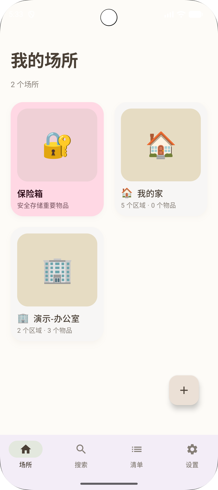
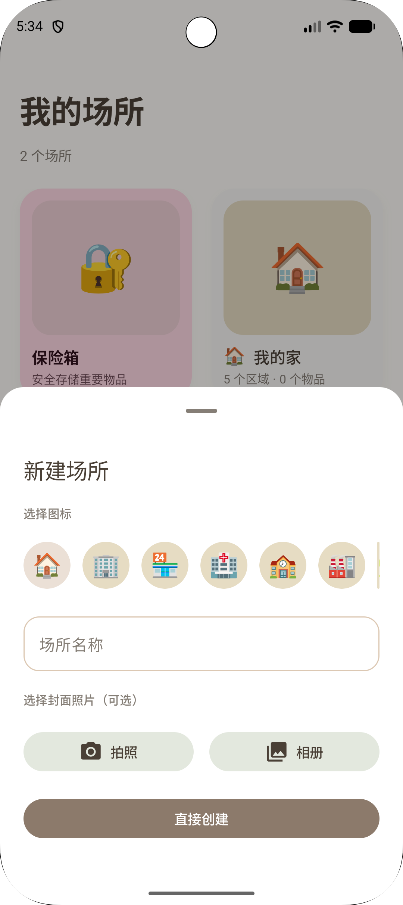
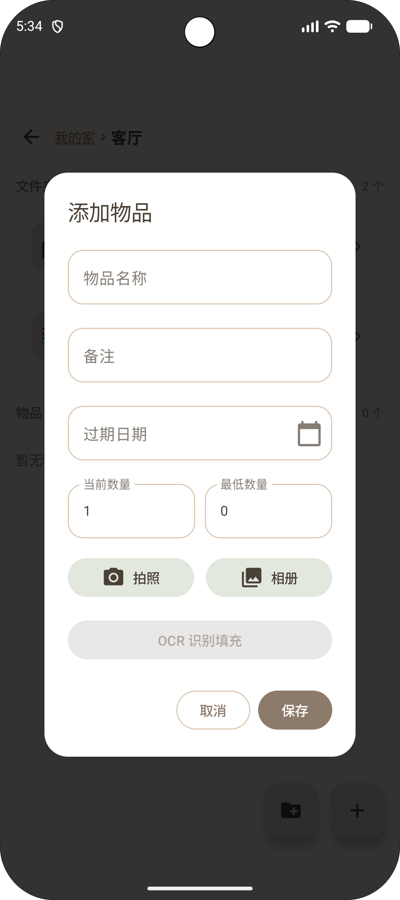
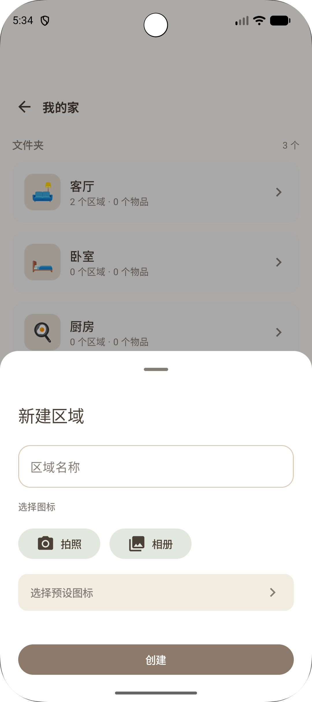
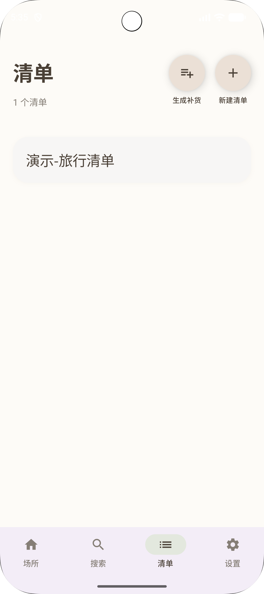

# 井井 (JingJing)

<div align="center">

📦 **一个优雅的个人物品管理应用**

让每一件物品都井井有条

[English](#english-version) | 简体中文

[](LICENSE)
[](https://www.android.com/)
[](https://kotlinlang.org/)

</div>

---

## 📖 简介

**井井**是一款专为家庭和个人设计的离线优先物品管理应用。它帮助你轻松记录、查找和管理散落在家中各个角落的物品，让生活更有条理。

<p align="center">
  
</p>

### ✨ 核心特性

#### 🏠 多层级空间管理

> 

- **场所（Locations）**：支持多个空间（如我的家、办公室）。内置丰富模板，一键快速开始。
- **区域（Folders）**：无限层级嵌套（房间 → 家具 → 抽屉 → 隔层），真实还原物理空间。
- **可视化导航**：清晰的面包屑导航，让你永远知道物品在哪里。
<br clear="all" />

#### 📸 智能物品录入

> 

- **拍照识别**：集成 Google ML Kit OCR，拍照自动识别物品名称，告别繁琐打字。
- **照片存储**：每个物品可附带照片，一目了然。
- **属性管理**：支持过期日期、库存数量、自定义标签等多维度管理。
<br clear="all" />

#### 🔍 强大的搜索与定位

> 

- **全文搜索**：按物品名称、备注快速查找。
- **路径筛选**：按场所、区域层级精确定位。
- **标签筛选**：支持多标签组合筛选（如 #药品 + #感冒）。
- **过期提醒**：自动追踪物品有效期，首页直观展示。
<br clear="all" />

#### 📋 清单与保险箱

> 

- **自定义清单**：旅行打包、购物计划随心创建，支持关联现有物品。
- **智能补货**：基于库存量自动生成补货清单。
- **隐私保险箱**：重要物品（如证件、银行卡）离线加密存储，支持生物识别解锁。
<br clear="all" />

---

## 🚀 快速开始

### 前置要求

- Android Studio Hedgehog (2023.1.1) 或更高版本
- JDK 11 或更高版本
- Android SDK (minSdk 24, targetSdk 36)
- Gradle 8.0+

### 构建步骤

1. **克隆仓库**
   ```bash
   git clone https://github.com/xiaobendaoke/SpaceWise.git
   cd jingjing
   ```

2. **配置 Firebase（可选）**
   
   如果需要 Crashlytics 功能，请：
   - 在 [Firebase Console](https://console.firebase.google.com/) 创建项目
   - 下载 `google-services.json` 并放置到 `app/` 目录
   - 如不需要，可移除 `build.gradle.kts` 中的相关依赖

3. **打开项目**
   ```bash
   # 使用 Android Studio 打开项目
   # File -> Open -> 选择项目目录
   ```

4. **同步依赖**
   ```bash
   ./gradlew build
   ```

5. **运行应用**
   - 连接 Android 设备或启动模拟器
   - 点击 Android Studio 的 Run 按钮 ▶️

---

## 🏗️ 技术架构

### 技术栈

| 技术 | 用途 |
|------|------|
| **Kotlin** | 主要开发语言 |
| **Jetpack Compose** | 声明式 UI 框架 |
| **Material 3** | UI 设计规范 |
| **Room** | 本地数据库（SQLite） |
| **Coroutines & Flow** | 异步编程 |
| **ViewModel** | MVVM 架构组件 |
| **Navigation Compose** | 应用导航 |
| **ML Kit Text Recognition** | OCR 文字识别 |
| **DataStore** | 轻量级数据存储 |
| **WorkManager** | 后台任务调度 |
| **Biometric** | 生物识别认证 |
| **Security Crypto** | 数据加密 |

### 架构设计

```
┌─────────────────────────────────────────┐
│         UI Layer (Compose)              │
│  LocationsScreen, FolderBrowserScreen   │
│  SearchScreen, ListsScreen, VaultScreen │
└──────────────────┬──────────────────────┘
                   │
┌──────────────────▼──────────────────────┐
│        ViewModel Layer                  │
│  SpaceViewModel, VaultViewModel         │
└──────────────────┬──────────────────────┘
                   │
┌──────────────────▼──────────────────────┐
│      Data Layer (Repository)            │
│  AppRepository, VaultRepository         │
└──────────────────┬──────────────────────┘
                   │
┌──────────────────▼──────────────────────┐
│   Database Layer (Room DAO)             │
│  AppDatabase, VaultDatabase             │
└─────────────────────────────────────────┘
```

详细架构说明请查看 [ARCHITECTURE.md](docs/ARCHITECTURE.md)

---

## 🤝 贡献指南

我们欢迎所有形式的贡献！详细贡献流程请查看 [CONTRIBUTING.md](CONTRIBUTING.md)

### 快速贡献步骤

1. Fork 本仓库
2. 创建功能分支 (`git checkout -b feature/AmazingFeature`)
3. 提交更改 (`git commit -m 'Add some AmazingFeature'`)
4. 推送到分支 (`git push origin feature/AmazingFeature`)
5. 提交 Pull Request

---

## 📄 许可证

本项目采用 MIT 许可证 - 详见 [LICENSE](LICENSE) 文件

---

## 🙏 致谢

- [Jetpack Compose](https://developer.android.com/jetpack/compose) - 现代 Android UI 工具
- [Material Design 3](https://m3.material.io/) - Google 设计规范
- [Google ML Kit](https://developers.google.com/ml-kit) - OCR 识别引擎
- 所有为本项目贡献代码的开发者

---

## 📧 联系方式

如有问题或建议，欢迎通过以下方式联系：

- 提交 [Issue](https://github.com/xiaobendaoke/SpaceWise/issues)
- 发起 [Discussion](https://github.com/xiaobendaoke/SpaceWise/discussions)

---

<div align="center">

**如果这个项目对你有帮助，请给一个 ⭐️ Star！**

Made with ❤️ by JingJing Contributors

</div>

---

## English Version

# JingJing

<div align="center">

📦 **An Elegant Personal Item Management App**

Keep every item organized and accessible

English | [简体中文](#井井-jingjing)

</div>

## 📖 Introduction

**JingJing** is an offline-first item management application designed for homes and individuals. It helps you easily record, find, and manage items scattered throughout your home, making life more organized.

<p align="center">
  
</p>

### ✨ Core Features

#### 🏠 Multi-level Space Management

> 

- **Locations**: Support for multiple spaces (e.g., My Home, Parents' Home, Office).
- **Folders**: Unlimited nesting levels (Room → Furniture → Drawer → Compartment).
- **Visual Navigation**: Breadcrumb navigation to quickly locate any item.
<br clear="all" />

#### 📸 Smart Item Entry

> 

- **Photo Recognition**: Integrated Google ML Kit OCR for automatic item name recognition.
- **Photo Storage**: Attach photos to each item for easy identification.
- **Attributes**: Manage expiration dates, inventory levels, and custom tags.
<br clear="all" />

#### 🔍 Powerful Search & Locate

> 

- **Full-text Search**: Quickly find items by name or notes.
- **Path Filtering**: Precisely locate by location and area levels.
- **Tag Filtering**: Multi-dimensional combination filtering (e.g., #Medicine + #Cold).
- **Expiry Alerts**: Automatically track and display item expiration dates on the home screen.
<br clear="all" />

#### 📋 Lists & Vault

> 

- **Custom Lists**: Create lists for travel packing, shopping plans, etc.
- **Smart Restock**: Auto-generate restock lists based on inventory levels.
- **Privacy Vault**: Encrypt important items (IDs, cards) offline with biometric unlock.
<br clear="all" />

---

## 🚀 Quick Start

### Prerequisites

- Android Studio Hedgehog (2023.1.1) or higher
- JDK 11 or higher
- Android SDK (minSdk 24, targetSdk 36)
- Gradle 8.0+

### Build Steps

1. **Clone the repository**
   ```bash
   git clone https://github.com/xiaobendaoke/SpaceWise.git
   cd jingjing
   ```

2. **Configure Firebase (Optional)**
   
   If you need Crashlytics functionality:
   - Create a project in [Firebase Console](https://console.firebase.google.com/)
   - Download `google-services.json` and place it in the `app/` directory
   - If not needed, remove related dependencies from `build.gradle.kts`

3. **Open the project**
   ```bash
   # Open with Android Studio
   # File -> Open -> Select project directory
   ```

4. **Sync dependencies**
   ```bash
   ./gradlew build
   ```

5. **Run the app**
   - Connect an Android device or start an emulator
   - Click the Run button ▶️ in Android Studio

---

## 🏗️ Tech Stack

### Technology

| Technology | Purpose |
|------------|---------|
| **Kotlin** | Primary development language |
| **Jetpack Compose** | Declarative UI framework |
| **Material 3** | UI design guidelines |
| **Room** | Local database (SQLite) |
| **Coroutines & Flow** | Asynchronous programming |
| **ViewModel** | MVVM architecture component |
| **Navigation Compose** | App navigation |
| **ML Kit Text Recognition** | OCR text recognition |
| **DataStore** | Lightweight data storage |
| **WorkManager** | Background task scheduling |
| **Biometric** | Biometric authentication |
| **Security Crypto** | Data encryption |

For detailed architecture documentation, see [ARCHITECTURE.md](docs/ARCHITECTURE.md)

---

## 🤝 Contributing

We welcome all forms of contributions! For detailed contribution process, see [CONTRIBUTING.md](CONTRIBUTING.md)

### Quick Contribution Steps

1. Fork this repository
2. Create a feature branch (`git checkout -b feature/AmazingFeature`)
3. Commit your changes (`git commit -m 'Add some AmazingFeature'`)
4. Push to the branch (`git push origin feature/AmazingFeature`)
5. Submit a Pull Request

---

## 📄 License

This project is licensed under the MIT License - see the [LICENSE](LICENSE) file for details

---

<div align="center">

**If this project helps you, please give it a ⭐️ Star!**

Made with ❤️ by JingJing Contributors

</div>
